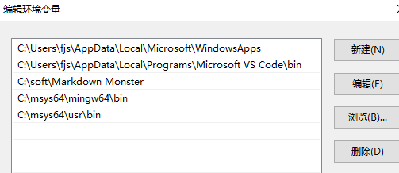

### git go 环境搭建
我这里一般是在windows上写代码,所以环境大多是win的.

```
源码地址 : github.com/wrzfeijianshen/go_tl/goenv/cpp
和百度云地址:
链接：https://pan.baidu.com/s/17bwudTenfQNNU8WD1s_S1w 
提取码：570g
```

安装git有很多的方式,一般采用 官方的Git for Windows,而它自带了 MSYS2来提供 Linux 终端功能,所以咱们平常情况是不用msys2的,但一些情况还是需要使用的,有些情况咱们也需要在windows 进行使用make 从而编译makefile脚本.

故而设置谁的环境变量靠前就使用谁,导致了环境的复杂性.所以咱们只安装msys2,用这个里面的自带的软件包,而不安装git Git-2.25.1-64-bit.exe 官方的版本.

参考之前的 https://blog.csdn.net/wrzfeijianshen/article/details/82820105

下载最新的版本机械能
http://repo.msys2.org/distrib/x86_64/msys2-x86_64-20200629.exe
安装

pacman-key --init
换源
拷贝 etc C:\msys64\etc\pacman.d

pacman -Syu                      #同步源，并更新系统 
pacman -Sy                        #仅同步源 
pacman -Su                        #更新系统

安装软件
pacman -S man gcc  tree base-devel git tar perl make openssl wget  mingw-w64-x86_64-pkg-config

拷贝 git 安装软件下的git-bash.exe 和 bin/bash.exe 照样可以使用一些命令行了.

设置环境变量


git version


关于 tdm gcc,如果发现msys2 gcc 编译出错等情况
如 sqlite3,就用 tdm,下载后,环境变量在msys2上方便可.
```
http://tdm-gcc.tdragon.net/
```

### 备留 关于git 的一些操作
```
git 代理

git config --global http.proxy socks5://127.0.0.1:1080
git config --global https.proxy socks5://127.0.0.1:1080

git config --global http.postBuffer 524288000
git config --global http.sslVerify false
https://github.com/git/git.git --depth 1  


git config --global credential.helper store

```

tortoiseGit设置


更改home目录 设置环境变量 HOME=C:\msys64\home\fjs

以下这个中文路径  ls 看不了中文,#命令行 输入不了中文

可能tortoseGit 添加中文文件,删除,会出现问题,所以用命令行进行,我觉得就是编码问题.

https://www.cnblogs.com/xinyuyuanm/archive/2013/04/24/3041101.html
```
export LANG=en
alias l='/bin/ls --show-control-chars --color=auto'
alias la='/bin/ls -aF --show-control-chars --color=auto'
alias ll='/bin/ls -alF --show-control-chars --color=auto'
alias ls='/bin/ls --show-control-chars --color=auto'
```
```  /etc/inputrc
#set output-meta on set convert-meta off
set meta-flag on
set input-meta on
set output-meta on
set convert-meta off
```

```
git tab 可以设置 
https://github.com/markgandolfo/git-bash-completion.git
下载
C:\msys64\home\fjs\.bashrc
source ~/git-completion.bash
重启即可
```

安装go exe

设置环境变量

GO111MODULE=on

GOPROXY=https://goproxy.io

GOPATH=c:/code

### vscode 终端

可百度 vscode中集成msys2终端

Terminal: Select Default Shell 

https://code.visualstudio.com/docs/editor/integrated-terminal#_terminal-keybindings

```
// Command Prompt
"terminal.integrated.shell.windows": "C:\\Windows\\System32\\cmd.exe"
// PowerShell
"terminal.integrated.shell.windows": "C:\\Windows\\System32\\WindowsPowerShell\\v1.0\\powershell.exe"
// Git Bash
"terminal.integrated.shell.windows": "C:\\Program Files\\Git\\bin\\bash.exe"
// Bash on Ubuntu (on Windows)
"terminal.integrated.shell.windows": "C:\\Windows\\System32\\bash.exe"
```

vscode只是默认了这几种cmd shell,咱们要替换的则是 git base shell,


以上便是操作的步骤,因为linux玩的很熟的话,这些都是最为基本的,因为切换cmd的话,则会替换掉之前输入的命令

比如说我修改随便一个cmd 命令 "terminal.integrated.shell.windows": "d:\\Program Files\\Git\\jianghu.exe"

一旦切换cmd便会没了,如果长期用一个则无所谓的,如果需要切换的话,则建议下面的操作.

咱们弄好msys2的环境变量了,输入 bash,则会立马显示出msys2的 命令行来.

其实 bash 就是 C:\msys64\usr\bin\bash.exe , 执行的命令便是找的bash.exe

 C:\msys64\usr\bin\mintty.exe  是很有多参数的, 可以调用msys2 mingw-w64等
 
 默认的mingw64.exe 应该是调用的mintty.exe,是带窗口的,不管怎么用命令行调用就会弹出一个对话框,而不是在原先的位置.
 
 mintty --help,咱们不能够直接调用这个

 你会发现 C:\msys64\msys2_shell.cmd  mingw64.exe  mingw32.exe 都是差不多的,无外乎换了字体,图标而已.


如果设置为默认的bash 更换为C:\\msys64\\bin\\bash.exe 便可以了

方式有很多种,咱推荐的便是写个小程序为名bash.exe ,system("bash");调用系统命令 bash即可.也可以直接到百度云去下载.编译好的.

cmd : bash.exe --help 可以看到很多命令

cpp 源码 ,生成之后bash.exe 放到 C:\Program Files\Git\bin\bash.exe

使用默认终端便可以了.


```
#include <iostream>
// #pragma comment(linker,"/subsystem:\"windows\" /entry:\"mainCRTStartup\"")

using namespace std;

int main(int argc,char** argv)
{
    //  -lstdc++   -mwindows
    // gcc -lstdc++  xxx.c 一般gcc编译cpp文件会这样用
    // -mwindows 是代表去掉黑窗口,而咱们需要这个黑窗口,所不能去掉
	// g++ -o bash.exe main.cpp  --> 生成的文件 C:\Program Files\Git\bin\bash.exe 即可

    // 调用系统命令即可. 
    system("bash");
    return 0;
}
```

```
例子1
Terminal:Windows Exec
{
    "terminal.integrated.shell.windows": "C:\\Program Files\\Git\\bin\\bash.exe",
}

例子2
{
    "terminal.integrated.shell.windows": "C:\\msys64\\msys2_shell.cmd", 
    "terminal.integrated.shellArgs.windows": ["-defterm", "-mingw64", "-no-start", "-here"]
}

修改 命令 参数: 
    "terminal.integrated.shellArgs.windows": [
      "/c",
      "set MSYSTEM=MINGW64&& set MSYS=winsymlinks:nativestrict&& set MSYS2_PATH_TYPE=inherit&& set CHERE_INVOKING=enabled_from_arguments&& C:/msys64/usr/bin/bash.exe --login -i",
    ]
    
```